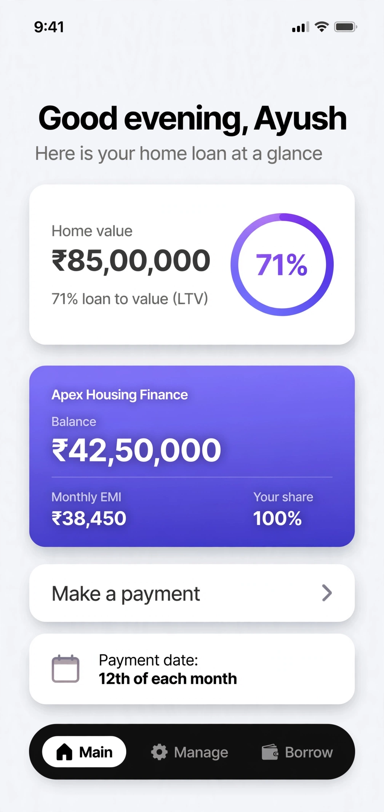
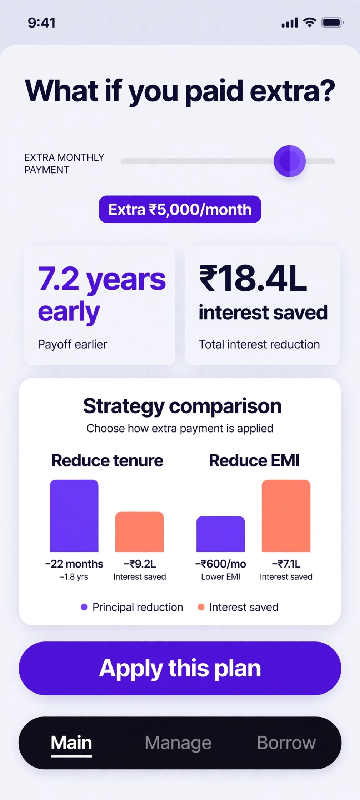
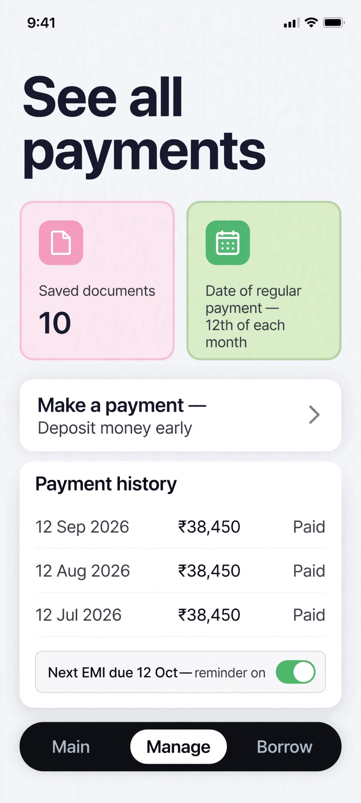
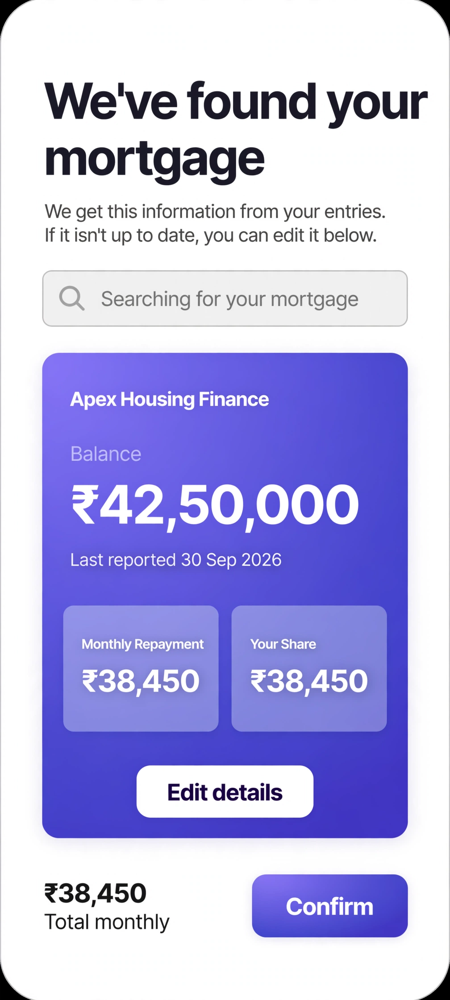

# Karz

Your home loan, minus the headache.

Karz tracks your home loan balance, LTV, prepayments and tax savings in one smooth app. No spam calls, no lead selling, no phone-number walls. Just your numbers, shown clearly.

## Screenshots

| | |
|---|---|
|  |  |
|  |  |

## What's inside

**Prepayment shock-math simulator.** Slide in an extra amount per month and watch exactly how many years you shave off and how much interest you save. Tenure-vs-EMI side by side, with a clear recommendation. This is the screen you'll screenshot and send to your family group.

**LTV tracking.** Animated loan-to-value ring with a plain-English band explainer, so you always know where you stand.

**Tax module (80C / 24b).** Estimates your tax saved on principal + interest, with old-vs-new regime comparison.

**Balance-transfer analyzer.** Prices the true cost of a transfer, including the tenure-reset trap most calculators hide.

**The basics, done right.** Payment reminders, EMI history with principal/interest split per EMI, and an encrypted document vault for your loan paperwork.

## Tech

- Native Android: Kotlin + Jetpack Compose (minSdk 26, targetSdk 35)
- Backend: Firebase — Phone Auth (OTP), Firestore with offline persistence, Cloud Storage, FCM reminders, Crashlytics
- Money math in minor units (paise), BigDecimal throughout, unit-tested amortization engine

## Get the app

Grab the latest APK from [Releases](https://github.com/kurupdevs/Karz/releases). Install with "Install unknown apps" allowed for your browser — Android will show the usual sideload prompt.

## Run it yourself

1. Clone the repo and open it in Android Studio.
2. The app runs fully offline-first with zero setup. For cloud sync + OTP login, link Firebase (5 minutes): create a project, drop the downloaded `google-services.json` into `app/`, enable Phone Auth + Firestore + Storage. Full steps: [FIREBASE-SETUP.md](https://github.com/kurupdevs/Karz/blob/main/FIREBASE-SETUP.md) (also in the repo root as `../FIREBASE-SETUP.md`).
3. `./gradlew assembleDebug`

CI builds every push to `main` and uploads the debug APK as an artifact.

## Roadmap

- Rate-change radar (EBLR reset alerts)
- Offer engine v2
- Co-borrower split view

---

Built by [kurupdevs](https://github.com/kurupdevs). © 2026, all rights reserved.
